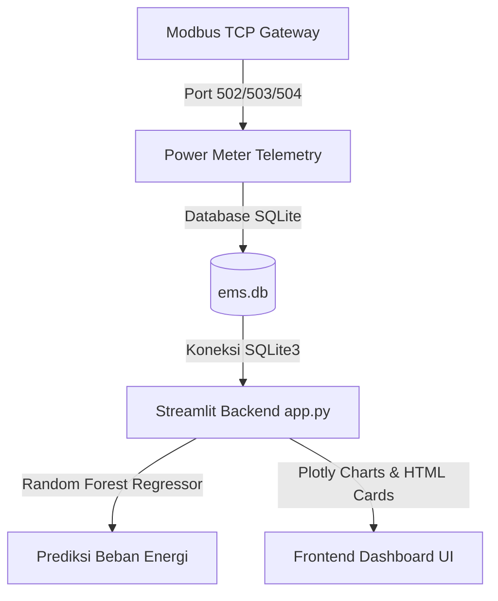

# EMS Enterprise - Sistem Pemantauan Energi Gedung

EMS Enterprise adalah aplikasi dashboard berbasis web interaktif yang dirancang untuk memantau, menganalisis, memprediksi, dan mengaudit konsumsi energi listrik pada 3 gedung operasional secara terpusat. Data telemetry diperoleh dari power meter gateway menggunakan protokol Modbus TCP pada port yang berbeda.

---

## Fitur Utama

1. **Dashboard Utama (Real-time Monitoring)**
   * Pemantauan daya aktif (Active Power kW), tegangan (Voltage V), dan frekuensi network (Hz) secara real-time.
   * Estimasi tagihan listrik otomatis dikonversi ke **Rupiah (Rp)** dengan tarif **Rp 1.350 / kWh**.
   * Breakdown alokasi beban menggunakan klasifikasi beban yang disederhanakan: **AC**, **Lighting**, dan **Equipment** (menghilangkan kategori EV Charging).
   * Log Aktivitas Beban Gedung untuk mencatat status konsumsi harian.

2. **Analisa Energi**
   * Perbandingan konsumsi energi kumulatif (kWh) antar periode waktu.
   * Konversi biaya langsung ke Rupiah di seluruh indikator.
   * Visualisasi tren konsumsi multi-gedung menggunakan diagram interaktif Plotly.

3. **Profile Gedung**
   * Manajemen metadata dan status operasional masing-masing gedung.
   * Pemetaan detail port Modbus: **Gedung 1 (Port 502)**, **Gedung 2 (Port 503)**, dan **Gedung 3 (Port 504)**.

4. **Forecasting Energi (Machine Learning)**
   * Prediksi beban listrik (Active Power kW) ke depan menggunakan algoritma **Random Forest Regressor**.
   * Evaluasi akurasi model secara transparan menggunakan metrik **R² Score** dan **RMSE**.
   * Grafik visualisasi interaktif perbandingan beban historis dengan prediksi masa depan.
   * Rekomendasi manajemen beban otomatis (AI Insights) untuk peak-shaving.

5. **Reports & Audit**
   * Laporan audit finansial BPK dan efisiensi energi bulanan yang dikonversi ke Rupiah.
   * Rekapitulasi konsumsi gedung dengan fitur ekspor data format CSV.

6. **Admin Settings**
   * Pengaturan harga tarif dasar listrik PLN (Default: Rp 1.350 / kWh).
   * Monitoring status koneksi real-time gateway Modbus TCP (Port 502, 503, dan 504).
   * Pengaturan target batas baseline energi tahunan/bulanan/harian.

---

## Petunjuk Instalasi & Penggunaan

### 1. Prasyarat Sistem
Pastikan Anda memiliki Python versi 3.8 atau yang lebih baru terinstal di sistem Anda.

### 2. Instalasi Dependensi
Instal pustaka Python yang diperlukan dengan menjalankan perintah berikut:
```bash
pip install -r requirements.txt
```

### 3. Menjalankan Aplikasi
Jalankan dashboard menggunakan Streamlit:
```bash
streamlit run app.py
```

### 4. Akun Login Default
* **Role**: `Admin`
  * **Username**: `admin`
  * **Password**: `admin`
* **Role**: `Super Admin`
  * **Username**: `superadmin`
  * **Password**: `superadmin`

---

## Arsitektur Sistem & Data

### Diagram Alir Data (Mermaid)



### Skema Database SQLite (`ems.db`)
Database terdiri dari tiga tabel pembacaan telemetry utama:
* `device1_readings` (Gedung 1 - Port 502)
* `device2_readings` (Gedung 2 - Port 503)
* `device3_readings` (Gedung 3 - Port 504)

Kolom pembacaan yang digunakan meliputi:
* `timestamp`: Waktu perekaman data (secara dinamis digeser ke waktu lokal saat ini untuk simulasi real-time).
* `power_total_kw`: Total beban daya aktif (nilai mutlak kW).
* `voltage_phase_a/b/c`: Tegangan fasa masing-masing jalur.
* `frequency`: Frekuensi grid listrik (Hz).
